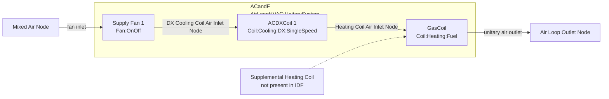
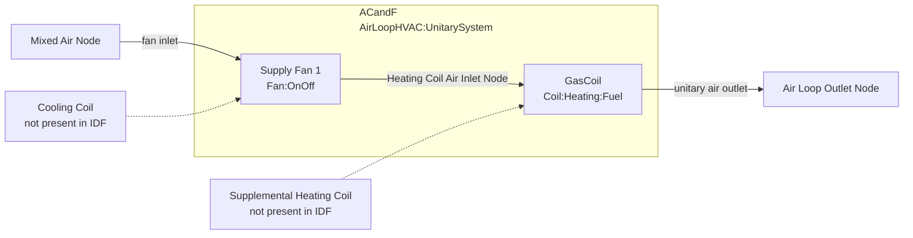

# UnitarySystem_AFN_RTF Test Diagrams

This file documents the IDF-defined air-side topology used by these unit tests in `tst/EnergyPlus/unit/UnitarySystem.unit.cc`:

- `EnergyPlusFixture.UnitarySystem_AFN_RTF`
- `EnergyPlusFixture.UnitarySystem_AFN_RTF_No_Supp_Coil`
- `EnergyPlusFixture.UnitarySystem_AFN_RTF_No_Cooling_Coil`

Scope and notes:

- These diagrams show the HVAC component types and their node-to-node connections.
- Building surfaces, schedules, curves, sizing objects, and thermostat details are omitted.
- The `No_Supp_Coil` and `No_Cooling_Coil` tests also override parsed `UnitarySystem` state in C++ after the IDF is loaded. The diagrams below show the IDF snippets as written.

## Test-to-topology map

| Test | Internal unitary chain | Cooling coil in IDF | Supplemental heating coil in IDF |
| --- | --- | --- | --- |
| `UnitarySystem_AFN_RTF` | `Fan:OnOff -> Coil:Cooling:DX:SingleSpeed -> Coil:Heating:Fuel` | Yes | No |
| `UnitarySystem_AFN_RTF_No_Supp_Coil` | `Fan:OnOff -> Coil:Cooling:DX:SingleSpeed -> Coil:Heating:Fuel` | Yes | No, fields explicitly blank |
| `UnitarySystem_AFN_RTF_No_Cooling_Coil` | `Fan:OnOff -> Coil:Heating:Fuel` | No | No, fields explicitly blank |

## Common air-loop and zone path

This outer air-loop and zone path is shared by all three tests. The only topology change between tests is inside the `ACandF` unitary system.

```mermaid
flowchart LR
    OA["Outside Air Inlet Node<br/>OutdoorAir:NodeList"]
    OAM["OA Mixing Box 1<br/>OutdoorAir:Mixer"]
    ACF["ACandF<br/>AirLoopHVAC:UnitarySystem"]

    subgraph SupplyPath["ACandFSupplyPath<br/>AirLoopHVAC:SupplyPath"]
        Splitter["Zone Supply Air Splitter<br/>AirLoopHVAC:ZoneSplitter"]
    end

    subgraph ADU["Zone2DirectAirADU<br/>ZoneHVAC:AirDistributionUnit"]
        Terminal["Zone2DirectAir<br/>AirTerminal:SingleDuct:ConstantVolume:NoReheat"]
    end

    Zone["EAST ZONE<br/>Zone"]

    subgraph ReturnPath["ACandFReturnPath<br/>AirLoopHVAC:ReturnPath"]
        Mixer["Zone Return Air Mixer<br/>AirLoopHVAC:ZoneMixer"]
    end

    OA -->|"Outside Air Inlet Node"| OAM
    OAM -->|"Mixed Air Node"| ACF
    ACF -->|"Air Loop Outlet Node"| Splitter
    Splitter -->|"Zone 2 Inlet Node 2AT"| Terminal
    Terminal -->|"Zone 2 Inlet Node"| Zone
    Zone -->|"Zone 2 Outlet Node"| Mixer
    Mixer -.->|"air-loop return / OA-system return stream"| OAM
```

## Internal unitary chain used by `UnitarySystem_AFN_RTF` and `UnitarySystem_AFN_RTF_No_Supp_Coil`

`UnitarySystem_AFN_RTF_No_Supp_Coil` uses the same airflow path as the baseline case. Its difference is that the supplemental-heating-coil fields are explicitly blank in the `AirLoopHVAC:UnitarySystem` object.

Text form:

- `Mixed Air Node`
- `Supply Fan 1` (`Fan:OnOff`)
- `ACDXCoil 1` (`Coil:Cooling:DX:SingleSpeed`)
- `GasCoil` (`Coil:Heating:Fuel`)
- `Air Loop Outlet Node`

## Internal unitary chain used by `UnitarySystem_AFN_RTF_No_Cooling_Coil`

This is the heating-only IDF topology. The cooling-coil object type/name fields are blank, the standalone DX cooling coil object is omitted, and the fan discharges directly to the heating coil inlet.

Text form:

- `Mixed Air Node`
- `Supply Fan 1` (`Fan:OnOff`)
- `GasCoil` (`Coil:Heating:Fuel`)
- `Air Loop Outlet Node`
